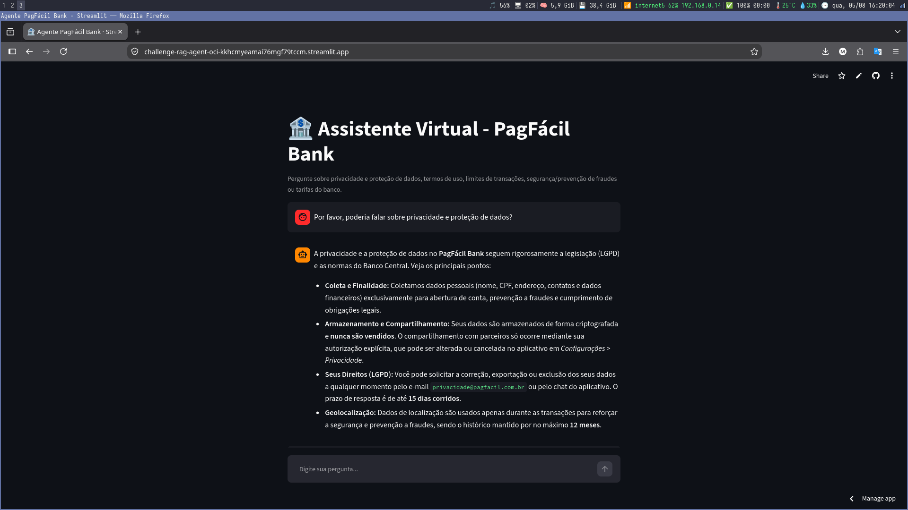
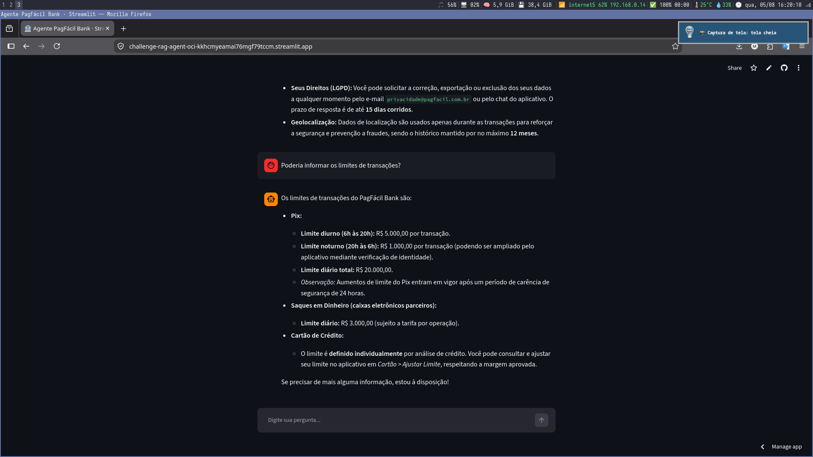

# Assistente Virtual para Banco Digital (RAG) — PagFácil Bank

Agente de IA que responde perguntas em linguagem natural sobre a documentação para
clientes de um banco digital fictício, o **PagFácil Bank**, cobrindo:

- Política de privacidade e proteção de dados (LGPD)
- Termos e condições de uso
- Perguntas frequentes sobre transações e limites (Pix, TED, cartão)
- Política de segurança e prevenção de fraudes
- Tarifas e comissões do serviço

Toda a documentação está em `data/pagfacil_docs.pdf`. O agente usa RAG
(Retrieval-Augmented Generation) para responder **somente com base no conteúdo do
documento**, evitando "inventar" políticas ou valores que não existem.

🔗 **Deploy oficial (OCI):** `<https://challenge-rag-agent-oci-kkhcmyeamai76mgf79tccm.streamlit.app/>`

📸 **Screenshot da aplicação rodando:**




---

## 1. Arquitetura

```
                         ┌─────────────────────────┐
                         │        Cliente          │
                         │  (navegador / browser)  │
                         └────────────┬────────────┘
                                      │ HTTP (porta 8501)
                                      ▼
                         ┌─────────────────────────┐
                         │  Streamlit (app.py)     │
                         │  Interface de chat      │
                         └────────────┬────────────┘
                                      ▼
                         ┌─────────────────────────┐
                         │ Agente LangChain        │
                         │        (agent.py)       │
                         └────────────┬────────────┘
                                      ▼
                    ┌───────────────────────────────────┐
                    │  Tool: consultar_documentacao     │
                    │  Retrieval (FAISS + embeddings)   │
                    │  → data/pagfacil_docs.pdf         │
                    │    (privacidade, termos, FAQ,     │
                    │     segurança/fraude, tarifas)    │
                    └────────────────┬──────────────────┘
                                     ▼
                         ┌─────────────────────────┐
                         │   LLM (Claude / GPT /   │
                         │   Gemini, via API)      │
                         └─────────────────────────┘
```

**Fluxo:**
1. O cliente faz uma pergunta na interface web (Streamlit).
2. Um agente ReAct (LangChain) aciona a ferramenta `consultar_documentacao`.
3. A ferramenta busca os trechos mais relevantes do PDF em um índice vetorial FAISS
   (embeddings locais via `sentence-transformers`, sem custo de API).
4. O LLM (Claude, GPT ou Gemini — configurável) recebe apenas esses trechos como
   contexto e formula a resposta final em português, sem extrapolar do que está
   documentado.

---

## 2. Tecnologias usadas

| Camada                 | Tecnologia                                                 |
|------------------------|------------------------------------------------------------|
| Linguagem              | Python 3.11 ou 3.12                                        |
| Orquestração do agente | LangChain (`create_react_agent`, `AgentExecutor`)          |
| Leitura de PDF         | `pypdf` / `PyPDFLoader`                                    |
| Embeddings             | `sentence-transformers` (all-MiniLM-L6-v2), local          |
| Índice vetorial        | FAISS                                                      |
| LLM                    | Gemini (padrão, grátis) — configurável para Claude ou GPT  |
| Interface              | Streamlit                                                  |
| Nuvem (deploy de teste)| Streamlit Community Cloud                                  |

---

## 3. Requisitos de uso

### 3.1. Python — **use a versão 3.11 ou 3.12**
As bibliotecas de IA/ML (`sentence-transformers`, `torch`, `faiss`) ainda não têm
suporte estável a versões muito recentes do Python (3.13+). Usar uma versão fora
dessa faixa costuma causar erros de compilação do `numpy`/`torch` durante o
`pip install`.

Verifique sua versão:
```bash
python3 --version
```

Se estiver fora do intervalo 3.11–3.12, instale uma versão compatível antes de
continuar (no Fedora/RHEL: `sudo dnf install python3.11`.

### 3.2. Chave de API de um provedor de LLM
Você precisa de **pelo menos uma** chave de API válida. Recomendamos o Gemini, que
tem cota gratuita e não exige cartão de crédito.

| Provedor | Onde gerar a chave | Custo |
|---|---|---|
| **Gemini** (recomendado) | https://aistudio.google.com/apikey | Gratuito, sem cartão |
| Anthropic (Claude) | https://console.anthropic.com/settings/keys | Pago (pouco crédito inicial) |
| OpenAI (GPT) | https://platform.openai.com/api-keys | Pago, exige cartão cadastrado |

### 3.3. Sistema operacional
Testado em Linux (Fedora).
`source .venv/bin/activate`).

---

## 4. Como executar localmente

```bash
git clone <https://github.com/MarcelFagundes/challenge-rag-agent-oci>
cd challenge-rag-agent-oci

python3.11 -m venv .venv
source .venv/bin/activate

pip install --upgrade pip
pip install -r requirements.txt

cp .env.example .env
```

Edite o `.env` e preencha o provedor escolhido. Exemplo com Gemini:

```
LLM_PROVIDER=gemini
GOOGLE_API_KEY=AIzaSy...sua-chave
```

### 4.1. Testar o agente no terminal (sem interface)
```bash
python agent.py
```
Isso indexa o PDF e roda 4 perguntas de exemplo já incluídas no código — é o
jeito mais rápido de confirmar que a chave de API e as dependências estão certas.

### 4.2. Rodar a interface web
```bash
streamlit run app.py
```
⚠️ **Importante:** use `streamlit run app.py`, **não** `python app.py` — apps
Streamlit precisam ser iniciados pelo comando próprio do framework, senão só
aparecem avisos (`missing ScriptRunContext`) e a interface não abre.

Acesse `http://localhost:8501` no navegador.

> **Dica:** para prototipar sem instalar nada localmente, use o
> [Google Colab](https://colab.research.google.com/): suba os arquivos do projeto
> e instale as dependências com `!pip install -r requirements.txt`.

---

## 5. Solução de problemas comuns

| Erro | Causa | Solução |
|---|---|---|
| `error: subprocess-exited-with-error` ao instalar `numpy`/`torch` | Versão do Python muito nova (3.13+) sem wheel pré-compilado | Recrie o `.venv` com Python 3.11 ou 3.12 (seção 3.1) |
| `Could not find a version that satisfies the requirement faiss-cpu==X` | Versão fixa do `faiss-cpu` não existe mais no PyPI | Já corrigido no `requirements.txt` (`faiss-cpu>=1.9.0`, sem versão travada) |
| `TypeError: Could not resolve authentication method` | O `.env` não tem a chave de API preenchida, ou não está na pasta certa | Confira `cat .env` e se o `LLM_PROVIDER` bate com a chave preenchida |
| `openai.RateLimitError: insufficient_quota` | Conta OpenAI sem créditos (a API não tem plano grátis) | Carregue créditos em platform.openai.com/settings ou troque para `LLM_PROVIDER=gemini` |
| `404 ... model ... is no longer available` | Nome de modelo desatualizado/descontinuado pelo provedor | Confira o modelo atual nas docs do provedor e ajuste `GOOGLE_MODEL` / `OPENAI_MODEL` / `ANTHROPIC_MODEL` no `.env` |
| `missing ScriptRunContext` ao rodar `python app.py` | Streamlit não deve ser executado como script Python comum | Use `streamlit run app.py` |

Se aparecer um erro não listado aqui, copie a mensagem completa (o traceback
inteiro) para investigar a causa real — a última linha do erro raramente conta
a história toda.

---

## 6. Exemplos de perguntas e respostas

| Pergunta | Seção da documentação | Resposta gerada pelo agente |
|---|---|---|
| "Qual é o limite de Pix durante a noite?" | FAQ de transações e limites | R$ 1.000,00 por transação entre 20h e 6h |
| "Quanto tempo tenho para contestar uma transação fraudulenta?" | Segurança e prevenção de fraudes | Até 90 dias a partir da data da transação, com análise em até 10 dias úteis |
| "O banco pode me ligar pedindo minha senha?" | Segurança e prevenção de fraudes | Não; o banco nunca solicita senha/OTP por telefone, SMS ou WhatsApp |
| "Quanto custa sacar no caixa eletrônico?" | Tarifas e comissões | R$ 6,50 por saque, com 4 saques gratuitos por mês |
| "Posso pedir para excluir meus dados pessoais?" | Privacidade e proteção de dados | Sim, conforme a LGPD, com resposta em até 15 dias corridos |
| "Existe tarifa de manutenção da conta?" | Termos e condições / Tarifas | Não para pessoa física; para PJ, gratuita até R$ 50.000 de faturamento mensal |

> ⚠️ Substitua esta tabela pelas respostas **reais** copiadas do seu terminal
> depois de rodar `python agent.py` — o requisito do desafio pede respostas
> geradas pelo agente, não apenas as esperadas.

---

## 7. Deploy de teste rápido — Streamlit Community Cloud

Útil para validar que a aplicação funciona na nuvem antes de configurar a OCI.
**Isto não substitui o deploy na OCI**, que é o entregável obrigatório do desafio
(seção 8) — use esta seção apenas como teste intermediário.

### 7.1. Subir o código no GitHub
O Streamlit Cloud precisa de um repositório público (ou privado, se você conectar
sua conta) no GitHub, já com `app.py`, `agent.py`, `requirements.txt` e a pasta
`data/`.

### 7.2. Criar o app
1. Acesse **https://share.streamlit.io/**
2. Faça login com sua conta GitHub
3. Clique em **"New app"**
4. Selecione o repositório, a branch (`main`) e o arquivo principal: `app.py`

### 7.3. Configurar as chaves (Secrets)
Como o `.env` não vai pro GitHub (está no `.gitignore`), configure as chaves
direto no painel do Streamlit Cloud:
1. No app criado, vá em **Settings → Secrets**
2. Cole no formato TOML, por exemplo:
```toml
LLM_PROVIDER = "gemini"
GOOGLE_API_KEY = "AIzaSy...sua-chave"
```
3. Salve — o Streamlit Cloud expõe esses valores como variáveis de ambiente,
   então o código (`os.getenv(...)`) funciona sem nenhuma alteração.

### 7.4. Deploy
Clique em **Deploy**. Em poucos minutos, o app estará disponível em uma URL
pública do tipo `https://challenge-rag-agent-oci-kkhcmyeamai76mgf79tccm.streamlit.app`.

> **Limitação:** o plano gratuito do Streamlit Cloud tem recursos limitados de
> CPU/RAM, o que pode deixar a indexação do PDF (`sentence-transformers`) mais
> lenta na primeira execução. Isso é normal.

---

## 9. Estrutura do repositório

```
challenge-rag-agent-oci/
├── agent.py               # lógica do agente (RAG sobre a documentação)
├── app.py                 # interface Streamlit
├── requirements.txt       # dependências Python
├── .env.example           # modelo de variáveis de ambiente
├── .gitignore
├── data/
│   └── pagfacil_docs.pdf  # documentação: privacidade, termos, FAQ, segurança, tarifas
└── README.md
```

## 10. Trocando de LLM

Basta alterar `LLM_PROVIDER` no `.env` para `anthropic`, `openai` ou `gemini` (e preencher a
chave correspondente). O código em `agent.py` (`get_llm()`) já trata a troca de provedor sem
precisar mudar mais nada. Se um modelo específico for descontinuado pelo provedor, ajuste
apenas `ANTHROPIC_MODEL` / `OPENAI_MODEL` / `GOOGLE_MODEL` no `.env` (ver seção 5).

## 11. Usando a documentação de outro banco/fintech

Substitua `data/pagfacil_docs.pdf` pelo(s) documento(s) da instituição desejada — pode ser um
único PDF combinando privacidade, termos, FAQ, segurança e tarifas (como neste projeto), ou
vários PDFs separados por tema. Basta listar os caminhos em `PDF_PATHS`, em `agent.py`; o
restante do pipeline (indexação, busca, agente) continua funcionando sem alterações.
